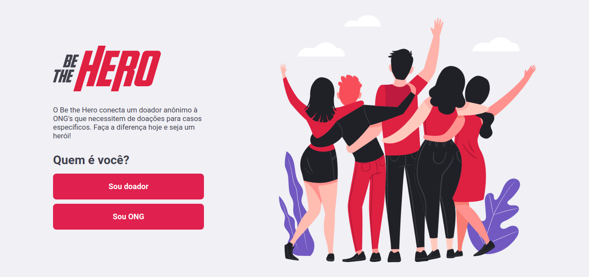

</img>

# Semana Omnistack 11 | Be the Hero :rocket:

O Be the Hero é uma aplicação que permite que ONG's de diversas instâncias postem casos que necessitem de doação e que pessoas anônimas entrem em contato com essas ONG para ajudarem com esses casos.

Ele fora proposto na Semama Omnistack 11, evento online organizado pela [Rocketseat](https://www.linkedin.com/school/rocketseat/).

:exclamation: **A parte mobile da aplicação não está desenvolvida! Para contornar isso, desenvolvi as features do frontend com React de tal forma que a aplicação não dependa da parte mobile** :exclamation:

## :arrow_forward: Executando a aplicação

Antes de mais nada, você precisa possui o Node.js em sua versão LTS instalado em sua máquina.

:bulb: *Meu ambiente de desenvolvimento fora o Lubuntu*

- Escolha uma pasta específica para armazenar o projeto;
- Rode o seguinte comando pelo terminal: `git clone https://github.com/EduardoPazz/semana-omnistack-11-be-the-hero.git`
- Então, entre na pasta do projeto: `cd semana-omnistack-11-be-the-hero/`

Agora, você ativará o servidor com Express:

- Entre na pasta backend/: `cd backend/`
- Instale as dependencias necessárias com: `npm install`. Isto pode demorar um pouco;
- Inicie o servidor com `npm start`. Caso sua máquina seja precária, isso pode causar lentidão;

Agora, você ativará o React:

- Migre para a pasta frontend/ com: `cd ../frontend/`
- Instale as dependencias necessárias com: `npm install`. Isto pode demorar um pouco;
- Inicie o React com `npm start`. Caso sua máquina seja precária, isso pode causar ainda mais lentidão;

Dentro de alguns segundos, o seu navegador principal abrirá com a página inicial do Be the Hero. Sinta-se livre para explorar as funcionalidades e propor melhorias.

## :shipit: Dependências usadas
- Celebrate
- Cors
- Express
- KNEX
- SQLite3
- cross-env
- nodemon
- JEST
- Supertest
- axios
- React
- React-DOM
- React-Icons
- React-Router-DOM
- React-Scripts

## :wrench: Contribuindo
Abaixo eu selecionei uma lista de issues que acabei notando enquanto desenvolvia. Sinta-se a vontade para analisá-la. Boa parte delas existem ou porque eu ainda não sei corrigí-las plenamente ou porque não possui tempo suficiente para isso.

Para contribuir, portanto, basta "forkear" o projeto para a tua conta, criar uma branch para a nova feature, "commitar" as suas mudanças, "pushar" para o GitHub e abrir uma PR (Pull Request).

## :point_right: Licença

Este código está sob a [licença MIT](/LICENSE).

## :construction: Issues
Eis algumas issues que já tenho consciência que devem ser resolvidas.
- Fazer o deploy
- Incrementar estilizações no que for possível;
- Melhorar autenticação das ONG's (JWT), e melhorar a forma que o ID é mostrado pro usuário;
- Finalizar os testes de integração;
- Permitir filtros na listagem de casos;
- Design responsivo;
- Mostrar número de casos na página Profile
- Atualizar o número de casos na tela do doador em tempo real caso uma ONG cadastre um novo caso;
- Formatar o input de número de telefone e de valor da doação ;

:bulb: *Pelo que tentei aplicar com o react-number-format, depender do placeholder para sinalizar o usuário o que informar no campo não será possível*

- Fornecer uma forma melhor do doador entrar em contato com a ONG, e desenvolver alguma forma automatizada de perguntar periodicamente se seus casos já foram resolvidos e, se sim, permitir que ela apague esses casos apenas marcando-os para tal, deixando a cargo do sistema fazer a "limpa";
- Melhorar a UX no que tange ao usuário:
    - Se ele for uma ONG que já fizera logon anteriormente e acessar a rota `/logon` novamente, automaticamente redirecioná-lo à `/profile`, sem necessidade de um novo logon;
    - Bloquear o usuário que tente acessar as rotas `/profile` ou `/incidents/new` sem estar logado antes (usando localStorage ou sessionStorage, creio eu);
    - Permitir que ele altere suas informações ou informações dos casos cadastrados.
